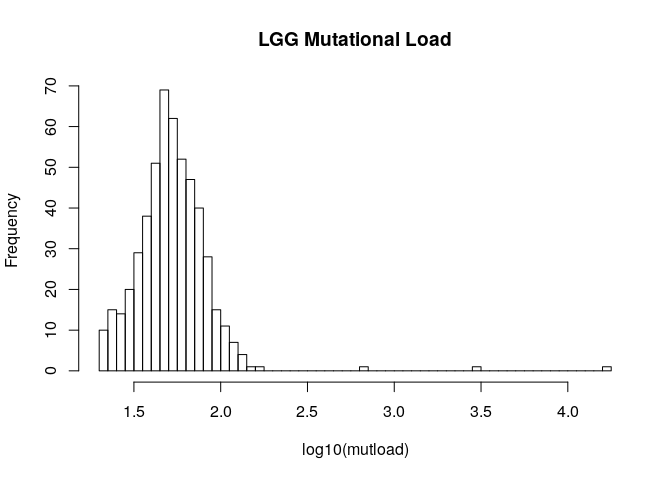
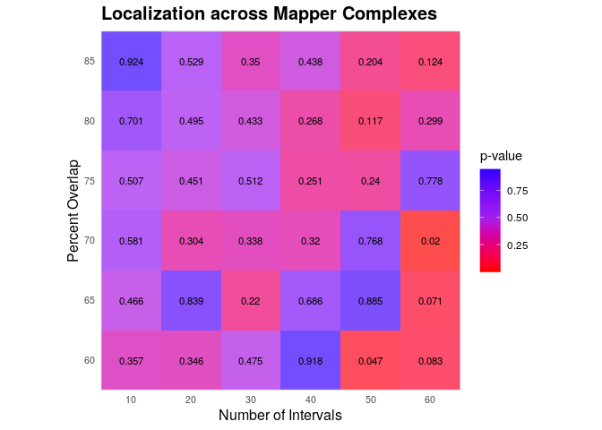
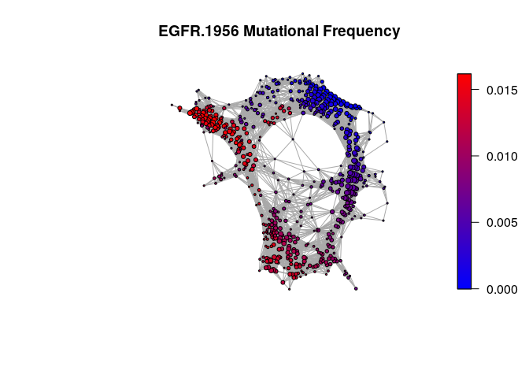
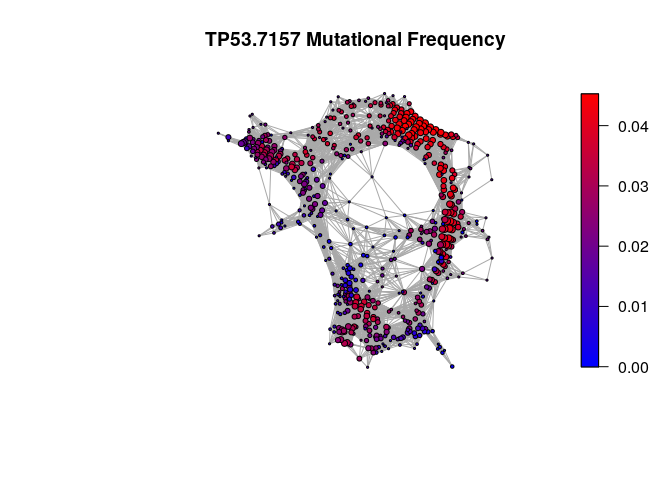
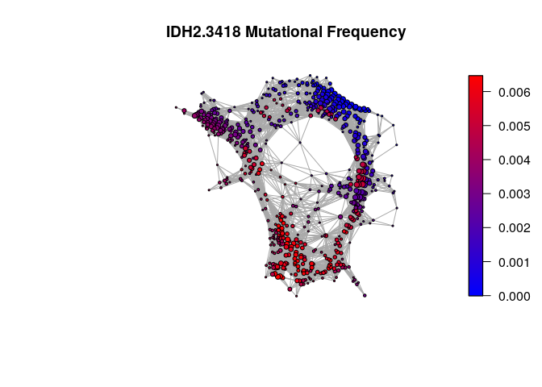
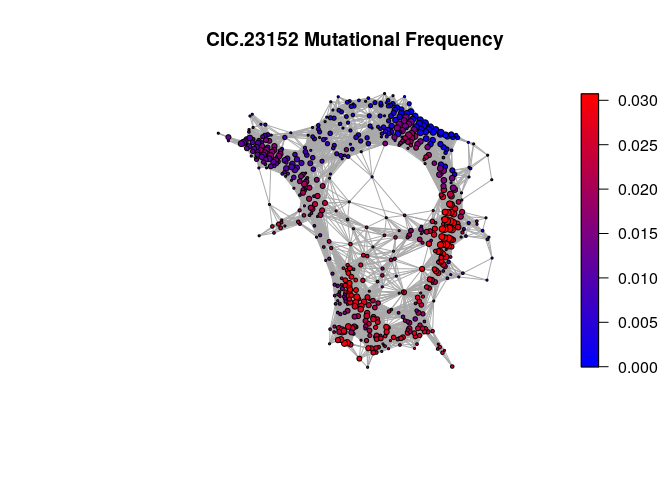

# TCGA-TDA
Pipeline for the identification of novel driver genes using TDA on TCGA data used in:

Rabadan R, Mohamedi Y, Rubin U, Chu T, Elliott O, Ares L, Cal S, Obaya AJ, Levine AJ, and Camara PG, _"Identification of Relevant Genetic Alterations in Cancer using Topological Data Analysis"_. Submitted.


Using TDAmut to analyze low grade glioma data
================

## Getting Started

We will use low grade glioma expression and mutation data to demonstrate
the TDAmut pipeline. The sample data is formatted from publically
available TCGA data and is provided in the `TDAmut` package. Expression
data is assumed to be normalized data (e.g. \(log_2[1+TPM]\)) formatted
as a matrix (rows = samples, columns = genes). Mutation data is assumed
be in a table organized by *Sample*, *Gene*, and *Type* (e.g. missense,
nonsense, splice, frameshift, …).

The user is afforded several options in each function of `TDAmut`. We
implemented default options which can be a helpful starting point for
the user.

## Creating TDAmut object for use throughout the pipeline

Here, we are creating a `TDAmut` object to be used as an intermediate
across all functions. This object holds data and topological
representations produced in this pipeline.

``` r
exp_matrix <- "data/LGG_Full_TPM_matrix.csv"
mut_table <- "data/LGG_Muts.txt"
LGG_object <- create_TDAmut_object(exp_matrix, mut_table)
```

``` lim-message
## Removed samples in expression data not in mutation data: 'TCGA-DU-7014-01A', 'TCGA-DU-A7TI-01A', 'TCGA-HW-7493-01A', 'TCGA-TQ-A7RK-02B'
```

``` lim-message
## The following genes have mutation data but no expression data. They will not be considered for optional filtering of negative correlations later in the TDAmut pipeline: 'LEPREL1.55214', 'KRTAP21-2.337978', 'MT-ND4.4538', 'HLA-DRA.3122', 'KAL1.3730', 'MT-ND5.4540', 'MT-CO1.4512', 'MT-CO3.4514', 'ZRSR1.7310', 'C14orf182.283551', 'HLA-DQB2.3120', 'GPR124.25960', 'GPR98.84059', 'KRTAP4-6.81871', 'HLA-DMB.3109', 'OR9G1.390174', 'FSIP2.401024', 'OR2T7.81458', 'FRG1B.284802', 'FRMPD3.84443', 'C12orf36.283422', 'HLA-DQA2.3118', 'NKX2-1.7080', 'KRTAP1-5.83895', 'ANKRD36C.400986', 'MT-CYB.4519', 'HLA-C.3107', 'KRTAP4-11.653240', 'KRTAP17-1.83902', 'CNTNAP3B.728577', 'KIAA1045.23349', 'GCN1L1.10985', 'HLA-F.3134', 'KRTAP4-4.84616', 'KRTAP9-9.81870', 'KRTAP19-1.337882', 'KRTAP10-5.386680', 'KRTAP4-2.85291', 'GPR112.139378', 'KRTAP10-3.386682', 'LPHN3.23284', 'KRTAP13-1.140258', 'KRTAP10-12.386685', 'HLA-A.3105', 'GPR110.266977', 'FAM115C.285966', 'UBBP4.23666', 'NPIPA5.100288332', 'ZNF812.729648', 'NKX2-2.4821', 'AKR1CL1.340811', 'BAI1.575', 'SLC9B1P1.100128190', 'KRTAP4-8.728224', 'CCDC132.55610', 'EBLN1.340900', 'KRTAP12-4.386684', 'CXorf22.170063', 'GPR115.221393', 'FAM178A.55719', 'GPR125.166647', 'AC073343.1.0', 'C4B.721', 'EMR1.2015', 'WDR16.146845', 'HEATR2.54919', 'NBPF20.100288142', 'MYZAP.100820829', 'KRTAP19-2.337969', 'LPHN2.23266', 'CHDC2.286464', 'TTC6.319089', 'KIAA1377.57562', 'ERO1LB.56605', 'MUC5AC.4586', 'KRTAP4-9.100132386', 'OR1D5.8386', 'KIAA1279.26128', 'SMEK1.55671', 'GPR111.222611', 'KIAA1244.57221', 'ZNF852.285346', 'C17orf70.80233', 'KRTAP10-10.353333', 'LEPRE1.64175', 'C1orf86.199990', 'KRTAP4-7.100132476', 'FAM154B.283726', 'FPGT-TNNI3K.100526835', 'GPR116.221395', 'DAK.26007', 'GPR128.84873', 'OTOGL.283310', 'EMR2.30817', 'HLA-DPB1.3115', 'LOC101929950.101929950', 'KRTAP5-2.440021', 'PCDHB17.54661', 'PLA2G4B.100137049', 'NHP2L1.4809', 'TMEM189-UBE2V1.387522', 'ANKRD32.84250', 'GPR113.165082', 'HLA-DMA.3108', 'KRTAP4-3.85290', 'GPR97.222487', 'C6orf211.79624', 'C7orf55-LUC7L2.100996928', 'LPHN1.22859', 'MUC3A.4584', 'TENC1.23371', 'HLA-E.3133', 'CCDC180.100499483', 'HLA-DRB1.3123', 'FAM154A.158297', 'GPR133.283383', 'B3GALTL.145173', 'GPR126.57211', 'PTPLAD2.401494', 'KRTAP5-4.387267', 'GPR64.10149', 'KRBOX1.100506243', 'RP11-467N20.5.0', 'CCL4L1.9560', 'PTGES3L.100885848', 'C5orf55.116349', 'TMEM194A.23306', 'SMEK2.57223', 'KRTAP10-7.386675', 'KRTAP9-8.83901', 'KRTAP1-1.81851', 'KRTAP9-2.83899', 'DEFA3.1668', 'KRTAP10-6.386674', 'ZFYVE20.64145', 'AGAP10.728127', 'KRTAP5-3.387266', 'IQCJ-SCHIP1.100505385', 'PRAMEF7.441871', 'KRTAP9-1.728318', 'ERO1L.30001', 'TCEB3CL2.100506888', 'IGJ.3512', 'KRTAP10-2.386679', 'ZNF724P.440519', 'FOLR4.390243', 'TMEM256-PLSCR3.100529211', 'ZNF587B.100293516', 'TRIM49C.642612', 'KRTAP5-1.387264', 'EMR3.84658', 'KRTAP10-1.386677', 'NCBP2L.392517', 'NKX3-1.4824', 'NPIPB4.440345', 'RP11-166B2.1.0', 'KRTAP5-8.57830', 'NPIPA8.101059953', 'GOLGA6L2.283685', 'CD97.976', 'KRTAP10-8.386681', 'RNF223.401934', 'C2orf43.60526', 'MT-CO2.4513', 'ELTD1.64123', 'ERVW-1.30816', 'HLA-DOA.3111', 'RBAK-RBAKDN.100533952', 'GOLGA8I.283796', 'ZNF783.100289678', 'UGT2B17.7367', 'HLA-DRB5.3127', 'KRTAP20-2.337976', 'NPIPB11.728888', 'GOLGA6L3.100133220', 'KRTAP21-1.337977', 'OPN1MW2.728458', 'KRTAP4-5.85289', 'WASH4P.374677', 'ZNF728.388523', 'FAM47E-STBD1.100631383', 'TRIM73.375593', 'OR52B1P.81274', 'IGHV3OR16-9.28307', 'MTPN.136319', 'NUTM2E.283008', 'MS4A4E.643680', 'OR4C5.79346', 'OR14K1.343170', 'HLA-DQA1.3117', 'KRTAP5-5.439915', 'C11orf72.100505621', 'KRTAP10-9.386676', 'KRTAP11-1.337880', 'RP11-146E13.4.0', 'TRAV9-2.28677', 'OTX2-AS1.100309464', 'LINC00969.440993', 'MT-ND2.4536', 'KRTAP9-3.83900', 'HLA-DRB6.3128', 'DAOA-AS1.282706', 'DNM1P47.100216544', 'RP11-423O2.5.0', 'LOC728339.728339', 'RP11-254I22.1.0', 'SNHG24.101929369', 'LINC00854.100874261', 'LOC727993.727993', 'MIR646HG.284757', 'AC027612.3.0', 'LOC63930.63930', 'IGHG1.3500', 'TUBB8P7.197331', 'MIR146A.406938', 'RP11-308D16.4.0', 'CTC-535M15.2.0', 'CCDC175.729665', 'TRGC2.6967', 'IGHA1.3493', 'KRT17P2.339241', 'RP11-739N20.2.0', 'RP11-686D16.1.0', 'OVOS2.144203', 'RP11-847H18.2.0', 'GOLGA6L17P.642402', 'SNHG14.104472715', 'LOC101928372.101928372', 'LOC400800.400800', 'FLJ16171.441116', 'NOS2P1.645740', 'SOX9-AS1.400618', 'SLC9A7P1.121456', 'TRAV8-2.28684', 'NANOGP1.404635', 'LOC101927905.101927905', 'IGLV3-12.28802', 'BAI3.577', 'HERC2P3.283755', 'KRT19P2.160313', 'LOC101927533.101927533', 'MIR381HG.378881', 'RP11-156P1.3.0', 'LINC00971.440970', 'TAPT1-AS1.202020', 'IGHV1OR16-3.28313', 'NUTM2B-AS1.101060691', 'HLA-V.352962', 'KIZ-AS1.101929591', 'IGHV4-28.28400', 'RP11-89K10.1.0', 'IGHV3-33.28434', 'RP11-1028N23.4.0', 'AC015849.16.0', 'RP11-625I7.1.0', 'ZNF503-AS1.253264', 'GNAS-AS1.149775', 'IGHD.3495', 'RP11-149P24.1.0', 'RP11-221N13.4.0', 'IGKV3D-20.28874', 'LINC00987.100499405', 'APCDD1L-AS1.149773', 'LLNLF-65H9.1.0', 'RP11-464F9.1.0', 'LINC00477.144360', 'RP11-807H22.7.0', 'RP11-122F24.1.0', 'ROCK1P1.727758', 'WASH6P.653440', 'RPL12P38.645688', 'BCRP2.400892', 'RP11-85G18.6.0', 'HNRNPKP3.399881', 'RP11-556I14.1.0', 'ZNRD1-AS1.80862', 'IGLV2-28.28812', 'MIR3687-2.103504728', 'LOC101927209.101927209', 'RP11-435B5.5.0', 'LOC101927755.101927755', 'MED15P9.285103', 'LOC403323.403323', 'GAPDHP15.642317', 'HCG17.414778', 'IGHG3.3502', 'H3F3AP4.440926', 'LOC101927079.101927079', 'RP11-504G3.4.0', 'RP11-252A24.2.0', 'UPF3AP2.147150', 'MRPS31P5.100887750', 'IGHG4.3503', 'CTB-134H23.3.0', 'HERC2P9.440248', 'IGLC3.3539', 'TRBV6-8.28599', 'TRBV5-4.28611', 'PBX2P1.5088', 'EIF4E2P2.645207', 'TRDV2.28517', 'UBA6-AS1.550112', 'LOC442028.442028', 'CCT6P3.643180', 'RP11-24M17.5.0', 'KTN1-AS1.100129075', 'LOC100288069.100288069', 'CTD-2251F13.1.0', 'RP11-433J8.2.0', 'MIR371B.100616185', 'LOC105371814.105371814', 'CTC-548K16.2.0', 'NDUFA6-AS1.100132273', 'CTC-260E6.6.0', 'LOC643201.643201', 'TBC1D3P3.653017', 'LRRC37A11P.342666', 'AC016995.3.0', 'KANTR.102723508', 'DPPA3P2.400206', 'RP11-44F14.1.0', 'ANKRD20A5P.440482', 'RP11-114H23.1.0', 'RP11-652G5.1.0', 'RP11-404F10.2.0', 'TRBV29-1.28558', 'IGHV1-18.28468', 'CTB-161M19.4.0', 'INTS4L2.644619', 'RP11-597A11.6.0', 'IGLV7-43.28776', 'TRBV6-7.28600', 'SRGAP2-AS1.100873165', 'IGHV3-38.28429', 'TRAV24.28659', 'SRGAP2B.647135', 'IGHV1-58.28464', 'RP5-991G20.1.0', 'XXbac-BPG308J9.3.0', 'IGHE.3497', 'RP11-324C10.1.0', 'IGHV3-11.28450', 'IGHV3-20.28445', 'RP11-608O21.1.0', 'GPR123.84435', 'RP11-782C8.1.0', 'TRBV19.28568', 'IGHV4OR15-8.28317', 'IGHV3-49.28423', 'MIR377.494326', 'TRAJ57.28698', 'GPR56.9289', 'TRAV41.28640', 'SNORD113-3.767563', 'MIR181A1.406995', 'TRAV27.28655', 'MAP3K14-AS1.100133991', 'MIR506.574511', 'TP73-AS1.57212', 'TRIM51HP.440041', 'IGLV2-23.28813', 'C20orf166-AS1.253868', 'IGHV3-72.28410', 'IGHV7-81.28378', 'MIR101-1.406893', 'TRBV4-1.28617', 'MIR380.494329', 'EMR4P.326342', 'IGKV6D-21.28870', 'SNORD114-31.767612', 'MIR518F.574472', 'TRBV6-5.28602', 'IGHV5-51.28388', 'TRBV6-1.28606', 'MIR518A1.574488', 'KRTAP9-4.85280', 'TRAV38-2DV8.28643', 'IGLV8-61.28774', 'IGKV3-20.28912', 'ATF4P4.100127952', 'IGHV3OR15-7.28318', 'HLA-B.3106', 'KIAA1598.57698', 'KRT16P2.400578', 'TRAV17.28666', 'MIR519A2.574500', 'HLA-F-AS1.285830', 'TRDJ1.28522', 'LEPREL2.10536', 'RPLP0P6.220717', 'PCDHB18.54660', 'IGLV3-16.28799', 'ZNF271.10778', 'TRBV11-1.28582', 'KRTAP5-9.3846', 'IGLV2-14.28815', 'TRBC2.28638', 'BAI2.576', 'IGKJ5.28946', 'RP11-337C18.8.0', 'FAIM3.9214', 'FAM21EP.100421577', 'IGHV1-45.28466', 'MIR509-1.574514', 'TRAV26-1.28657', 'IGHV1-24.28467', 'IGHV4-59.28392', 'MIR96.407053', 'IGHG2.3501', 'IGKV1-12.28940', 'LINC00842.643650', 'LRRC53.100144878', 'IGLV6-57.28778', 'BGLT3.103344929', 'TRAV18.28665', 'MIR517A.574479', 'CHEK2P2.646096', 'TRGV9.6983', 'TRDC.28526', 'MIR548A1.693125', 'IGLV11-55.28770', 'TRAV3.28690', 'TBC1D3P5.440419', 'TRGC1.6966', 'PPP1R2P1.100507444', 'IGLV2-18.28814', 'TRBV5-1.28614', 'RP11-156P1.2.0', 'IGLV4-3.28786', 'MIR450A1.554214', 'LOC100507291.100507291', 'LOC101927126.101927126', 'RP11-399K21.11.0', 'TRAV21.28662', 'LINC01500.102723742', 'RP11-439I14.2.0', 'TRBV7-6.28592', 'IGLV5-37.28783', 'TRBV6-6.28601', 'PDPK2P.653650', 'RP11-353N4.5.0', 'GLUD1P2.100381203', 'RP11-67H24.2.0', 'RP13-329D4.3.0', 'KRTAP12-2.353323', 'RP11-271K11.5.0', 'LA16c-23H5.4.0', 'IL9RP3.729486', 'MT1HL1.645745', 'MIR548I2.100302277', 'ZNRF2P2.100271874', 'FAM66B.100128890', 'IGLV1-40.28825', 'HIST2H2BB.338391', 'IGHV3-64.28414', 'LINC00639.283547', 'NUP210P1.255330', 'KRTAP15-1.254950', 'BNIP3P1.319138', 'AC005013.5.0', 'STARD7-AS1.285033', 'AC009120.6.0', 'KRTAP12-1.353332', 'LINC00886.730091', 'KRTAP5-11.440051', 'LOC100130700.100130700', 'TRBV10-2.28584', 'IGLV7-46.28775', 'MIR30B.407030', 'SPACA6P-AS.102238594', 'LINC01597.400841', 'RP11-991C1.2.0', 'RNA5-8SP6.100873336', 'IGLV3-25.28793', 'IGHV3-30.28439', 'LOC101926911.101926911', 'TRBV10-1.28585', 'BSNDP4.106481726', 'NKX2-8.26257', 'AL132989.1.0', 'MIR297.100126354', 'GPR42.2866', 'IGLV3-22.28795', 'AP001347.6.0', 'RP11-159L20.2.0', 'IGHV3-43.28426', 'LINCMD1.101154644', 'RP11-13J8.1.0', 'LRRC37A5P.652972', 'RP11-21G20.3.0', 'ACN9.57001', 'RP11-377D9.3.0', 'ZNF528-AS1.102724105', 'RP11-344E13.3.0', 'MIR517C.574492', 'MTHFD2P1.100287639', 'LOC101927460.101927460', 'LOC101926941.101926941', 'LINC01158.100506421', 'LRCOL1.100507055', 'KRTAP5-10.387273', 'PROX1-AS1.100505832', 'ZNF730.100129543', 'TPTE2P2.644623', 'MIR9-2.407047', 'RP11-340I6.7.0', 'RASA4B.100271927', 'LOC100506457.100506457', 'LOC105373525.105373525', 'CTD-2185K10.1.0', 'CTC-436P18.1.101928630', 'RP11-239H6.2.0', 'RP3-428L16.1.0', 'RP11-27P7.1.0', 'KB-1615E4.2.0', 'KB-1507C5.4.0', 'RP11-1113L8.1.0', 'LOC440446.440446', 'LINC01476.101927728', 'LINC00229.414351', 'LOC101928627.101928627', 'MIR337.442905', 'RP1-241P17.4.0', 'TRBV11-2.28581', 'RP11-640M9.2.0', 'CTD-2296D1.4.0', 'IGHV1OR15-9.390531', 'RP11-51L5.5.0', 'IGHV3-48.28424', 'LOC101928663.101928663', 'RP11-114H24.4.0', 'RP11-478C19.2.0', 'MIR892A.100126342', 'LOC400867.400867', 'LOC283683.283683', 'GS1-124K5.2.0', 'AZGP1P1.646282', 'LINC01359.101927084', 'LOC101927237.101927237', 'LOC101927708.101927708', 'AC073321.4.0', 'MIR663AHG.284801', 'RP11-597A11.1.0', 'IGKV1-6.28943', 'MIR7162.102466227', 'KRTAP10-11.386678', 'RP11-1082L8.3.0', 'RPL34-AS1.285456', 'RP11-526A4.1.0', 'CCNB3P1.100131678', 'RP11-436D23.1.0', 'RP11-314D7.1.0', 'LOC101243545.101243545', 'LOC100507377.100507377', 'TRGV4.6977', 'CTC-512J12.4.0', 'AC018359.1.0', 'CTD-2269F5.1.0', 'KRT223P.643115', 'MIR520E.574461', 'AC007251.2.0', 'RP11-390F4.6.0', 'AC012322.1.0', 'RP11-483E23.2.0', 'RNA5-8SP2.100873571', 'HLA-DOB.3112', 'MIR522.574495', 'PTPLAD1.51495', 'SMURF2P1.0', 'NPIPB1P.729602', 'DNM1P34.729809', 'TRBV7-3.28595', 'LINC00202-2.731789', 'KRT16P6.353194', 'IGKV5-2.28907', 'LINC01378.103689918', 'SUDS3P1.285647', 'GOLGA2P9.440518', 'IL12A-AS1.101928376', 'CYP21A1P.1590', 'LOC101927648.101927648', 'RP11-19N8.4.0', 'C1orf85.112770', 'LINC01239.441389', 'IGLV1-50.28821', 'AP001604.3.0', 'OR10J8P.343409', 'RP11-178C3.1.0', 'LINC01250.101927554', 'HSPD1P6.645548', 'IGHV2-26.28455', 'LINC01122.400955', 'LINC01229.101928248', 'RP11-493L12.5.0', 'LINC00499.100874047', 'LINC00621.100996930', 'IGKV1D-17.28900', 'LIPE-AS1.100996307', 'SMPD4P1.645280', 'LOC101928553.101928553', 'LOC100507053.100507053', 'OR8G1.26494', 'TRGV3.6976', 'SLC2A1-AS1.440584', 'KRTAP19-8.728299', 'PINLYP.390940', 'SMG1P7.100506060', 'LOC101927575.101927575', 'RP11-274B21.1.0', 'MEF2C-AS1.101929423', 'DUXAP8.503637', 'LINC01269.103695436', 'LOC101927040.101927040', 'TRDV1.28518', 'TRBV6-4.28603', 'SNHG23.100507242', 'CTC-338M12.9.0', 'CTD-2184D3.5.0', 'FAM74A7.100996582', 'SNORD3C.780853', 'LOC728715.728715', 'ANKRD30BP3.338579', 'RP11-93K22.13.0', 'CTC-439O9.3.0', 'LOC101928880.101928880', 'TRBV7-1.28597', 'RP11-1166P10.6.0', 'RP1-167F1.2.0', 'LOC101928940.101928940', 'RP11-25I15.2.0', 'LOC100289333.100289333', 'RP11-180I4.2.0', 'IGLV5-45.28781', 'IGHD3-10.28499', 'GOLGA6L7P.728310', 'IGHV3-13.28449', 'SNAP25-AS1.100131208', 'IGHV4-61.28391', 'IGHV3OR16-8.388255', 'CSAG4.100130935', 'RP11-418J17.3.0', 'CTD-2377D24.8.0', 'LOC101929350.101929350', 'KRTAP13-3.337960', 'IGKV6D-41.28869', 'GRIFIN.402635', 'SDCCAG3P1.388478', 'RP5-963E22.4.0', 'LOC101929066.101929066', 'CTD-2066L21.3.0', 'CTD-3092A11.1.0', 'SRP54-AS1.100506157', 'ANKRD20A2.441430', 'LOC100505782.100505782', 'USP32P3.347716', 'IGHV3-53.28420', 'STEAP2-AS1.100874100', 'LINC00674.100499466', 'IGHA2.3494', 'CTD-2245F17.3.0', 'IGHM.3507', 'LOC100420587.100420587', 'LOC642426.642426', 'NKX3-2.579', 'SVILP1.645954', 'LOC100287072.100287072', 'INTS4L1.285905', 'RP11-451O13.1.0', 'RP11-383M4.6.0', 'QRSL1P2.100422330', 'RP11-481J13.1.0', 'TRGV2.6974', 'IGKV1D-16.28901', 'RP11-586K2.1.0', 'SORD2P.653381', 'RP11-645C24.5.0', 'TRAV12-2.28673', 'RP13-228J13.1.0', 'SDAD1P1.157489', 'IGHV1OR16-2.28314', 'AC006988.1.0', 'ISX-AS1.101926957', 'RP11-587D21.4.0', 'LINC01317.104355287', 'LINC00459.100874180', 'IGKV1D-12.28903', 'LINC00202-1.387644', 'TRBV3-1.28619', 'MIR34A.407040', 'RP11-170M17.1.0', 'TRAV7.28686', 'IGHV3-21.28444', 'CYP4F24P.388514', 'TBC1D27.96597', 'LINC00359.100887754', 'LINCR-0001.101929191', 'NIFKP6.100132796', 'CTC-559E9.6.0', 'CTC-513N18.6.0', 'RP11-20E24.1.0', 'TRAJ24.28731', 'ANKRD20A18P.391269', 'LINC00877.285286', 'RP11-161I6.2.0', 'MIR494.574452', 'IGKV1D-8.28904', 'RP11-782C8.2.0', 'AC002331.1.0', 'RP11-796E2.4.0', 'AC005077.5.0', 'FAM177A1P1.728710', 'LOC101928782.101928782', 'MIR24-2.407013', 'MIR940.100126328', 'LOC100289656.100289656', 'EMC3-AS1.442075', 'RP11-431K24.1.0', 'IGHJ6.28475', 'RP11-525A16.4.0', 'MT-ND6.4541', 'IGHV1-46.28465', 'LINC01076.106144602', 'LL22NC03-86D4.1.105373010', 'KRTAP5-6.440023', 'IGHV3-16.28447', 'RP11-509A17.3.0', 'AP000320.7.0', 'RP11-519G16.3.0', 'ERICH1-AS1.619343', 'CTB-35F21.1.0', 'RP5-905H7.3.0', 'SNORD3B-1.26851', 'TRBV9.28586', 'RP11-23E10.4.0', 'RP11-556N21.1.0', 'IGHV1OR21-1.390530', 'RP11-206L10.10.0', 'RP11-35J10.5.0', 'MIR508.574513', 'LOC100132077.100132077', 'CTD-2532D12.4.0', 'TRBV20-1.28567', 'NPIPB6.728741', 'COX10-AS1.100874058', 'KRT17P4.339186', 'TRAV13-1.28671', 'TRBV6-9.28598', 'RP1-30E17.2.0', 'IGKV2D-29.28882', 'TRBV28.28559', 'TBC1D3P1-DHX40P1.653645', 'MIR526B.574468', 'TRBV5-7.28608', 'LOC101928823.101928823', 'LINC00511.400619', 'KRTAP10-4.386672', 'RP11-275O4.3.0', 'CPHL1P.389160', 'LOC105375875.105375875', 'RP11-260M19.2.0', 'TRAV19.28664', 'HIST2H3PS2.440686', 'LINC00857.439990', 'TRBV27.28560', 'LINC01331.104310351', 'MRPL42P4.346470', 'RP11-420N3.2.0', 'IGLV9-49.28773', 'CTD-2503O16.4.0', 'SPDYE18.100505767', 'LOC643542.643542', 'RPL39P5.553117', 'CHORDC2P.317775', 'RP11-3P22.2.0', 'CCRN4L.25819', 'IGHV1OR16-4.28312', 'TRBV7-7.28591', 'RP11-649A16.1.0', 'AL133247.2.0', 'LOC100287934.100287934', 'RP11-1060J15.4.0', 'HMGB3P5.645360', 'TUBBP1.92755', 'IGKV1-16.28938'
```

``` r
LGG_object@expression_table[1:5, 1:5]
```

    ##                  A1BG.AS1.503538 A1BG.1 A1CF.29974 A2M.AS1.144571  A2M.2
    ## TCGA-CS-4938-01B          2.7407 2.4365          0         0.4432 8.9506
    ## TCGA-CS-4941-01A          1.6222 2.3834          0         1.7243 9.4713
    ## TCGA-CS-4942-01A          2.0342 2.4167          0         0.3698 9.3009
    ## TCGA-CS-4943-01A          1.5353 1.4604          0         0.3816 8.7217
    ## TCGA-CS-4944-01A          0.9567 1.0011          0         0.4874 8.2942

``` r
LGG_object@mutation_table[1:5, ]
```

    ##             Sample           Gene Mutation              Type
    ## 1 TCGA-CS-4938-01B    PRPF8.10594 p.R1141C Missense_Mutation
    ## 2 TCGA-CS-4938-01B       TPO.7173  p.G712S Missense_Mutation
    ## 3 TCGA-CS-4938-01B RPS19BP1.91582  p.K115E Missense_Mutation
    ## 4 TCGA-CS-4938-01B      FGF5.2250  p.R205G Missense_Mutation
    ## 5 TCGA-CS-4938-01B    KDM7A.80853  p.S318R Missense_Mutation

## Creating topological representations of expression data

The `LGG_object` is passed to compute\_complexes, which uses TDAmapper
and RayleighSelection R packages to create nerve complexes across a grid
of Mapper parameters (2D intervals and their percent overlap). We create
several nerve complexes across a broad range of parameters to ensure
stable results.

The `LGG_object` is populated with the topological representations and
the parameters used to make
them.

``` r
LGG_object <- compute_complexes(LGG_object, filter_method = 'KNN', k = 30, min_interval = 10, max_interval = 60, interval_step = 10, min_percent_overlap = 60, max_percent_overlap = 85, percent_step = 5)
```

## Computing mutational load and its localization within the topological representations

Spurious correlations between the mutation rate and tumor expression
profile can confound our approach. An example comes from hypermutated
tumors and their often distinctive expression profiles. Localized
regions in expression spaces consisting of these tumors can also harbor
accumulated passenger mutations that confound our approach. To control
for these correlations, `compute_mut_load` computes the mutational tumor
burden (total number of somatic mutations in each tumor) and assesses
its localization across the topological representations of expression
data. If significant localization is seen, tumors with a mutational load
above a user-defined threshold have their mutations downsampled such
that their median mutational load matches the median mutational load of
other samples. The user is also able to set a minimum mutational
threshold to eliminate samples with few mutations (e.g. low tumor
purity). Nerve complexes may be recomputed without samples below this
minimum threshold by using `compute_complexes(..., recompute = TRUE)`

After computing mutational load with `compute_mut_load`, 13 samples with
mutational load below ~20 (\(10^{1.3}\)) are removed. Since samples were
removed, we must recompute nerve complexes without them. `plot_mut_load`
shows us that 3 samples have a significantly higher mutational load than
other samples. However, we see very few regions of the parameter grid
with localization of mutational load, so we
    continue.

``` r
LGG_object <- compute_mut_load(LGG_object, min_mutload = 1.3)
```

    ## The following samples have a mutational load less than 19: 'TCGA-CS-6669-01A', 'TCGA-DB-5278-01A', 'TCGA-DB-A75P-01A', 'TCGA-DU-6404-01A', 'TCGA-DU-6406-01A', 'TCGA-FG-8189-01B', 'TCGA-HT-8019-01A', 'TCGA-HT-8107-01A', 'TCGA-HT-8558-01A', 'TCGA-HT-A61A-01A', 'TCGA-P5-A5EY-01A', 'TCGA-P5-A5F6-01A', 'TCGA-VM-A8C9-01A'

    ## Consider using compute_complexes to recompute nerve complexes without these samples

``` r
plot_mut_load(LGG_object)
```

<!-- --><!-- -->

``` r
LGG_object <- compute_complexes(LGG_object, filter_method = 'KNN', k = 30, min_interval = 10, max_interval = 60, interval_step = 10, min_percent_overlap = 60, max_percent_overlap = 85, percent_step = 5, recompute = TRUE)
```

## Assessing current results by visualizing topological representations

To check the validity of the options chosen in the pipeline so far, we
want to visualize our data on the topological representations. We expect
to see localization of mutated genes which have been previously
identified as distinct markers of low grade glioma subtypes.

  - IDH1 mutations in a subtype of astrocytoma
  - ATRX mutations in a astrocytic gliomas
  - CIC mutations in oligodendromas

We’ve chosen the topological representation created with 2D intervals =
30 and percent overlap = 75. More can be specified in a vector of
interval and percent pairs passed to `which_complexes`. By default, 3
representations with parameters in the middle of the parameter range are
chosen.

``` r
LGG_genes <- c('EGFR.1956', 'TP53.7157', 'IDH2.3418', 'CIC.23152')

plot_mapper(LGG_object, type = 'mutation', features = LGG_genes, which_complexes = c(30,75))
```

    ## Plotting nerve complex with 2D intervals = 30 and percent overlap = 75

<!-- --><!-- --><!-- --><!-- -->

## Filtering genes by mutation frequency, highest fraction of nonsynonymous mutations, and negative correlations between expression and mutation data

Genes can be filtered by

  - Mutational frequency among all samples
  - Those with the greatest ratio of nonsynonymous mutations to total
    mutations
  - Associations between expression and mutation rates of a gene

For example, anticorrelations between expression and mutation rates can
arise due to transcription-coupled DNA repair. To correct for this, we
assess the similarity of expression and mutation profiles within the
topological representations using Jensen Shannon Divergence (JSD). A p
value is estimated by comparing the actual JSD to a null distribution
generated by permuting the sample IDs in the mutation data and
calculating JSD. The number of permutations used should be increased
accordingly to the number of genes that pass filtering thresholds. 1000
permutations is sufficient for many scenarios.

Note: `filter_genes` is the most time-intensive function of `TDAmut` and
can take a couple hours. Consider using the `num_cores` argument to
parallelize this
function.

``` r
LGG_object <- filter_genes(LGG_object, freq_threshold = 0.02, top_nonsyn_fraction = 300, negative_correlations = TRUE, num_permutations = 1000)
```

    ## Not considering the following genes with no expression data: 'ANKRD36C.400986', 'FRG1B.284802', 'GPR98.84059', 'KRTAP4-11.653240', 'KRTAP4-9.100132386', 'NPIPA5.100288332', 'UBBP4.23666'

## Assessing localization of filtered genes

Filtered genes are assessed for localization across the topological
representations using `RayleighSelection`. Localization is quantified
via a p value, estimated by a similar permutation scheme as noted above.
The false discovery rate is controlled using the Benjamini-Hochberg
procedure, which results in an accompanying localization q value.

Genes with a median JSD q value above the threshold specified by the
`negative_correlations_threshold` argument are not considered, as they
display an anticorrelation between expression and mutation rates.

Note: Consider using the `num_cores` argument to parallelize
`compute_gene_localization` if filtering thresholds are
relaxed.

``` r
LGG_object <- compute_gene_localization(LGG_object, negative_correlations_threshold = 0.8, num_permutations = 5000)
```

    ## Not considering the following 52 genes displaying negative correlations between mutation and expression data: 'ABCA13.154664', 'ACACB.32', 'AFF2.2334', 'AHNAK2.113146', 'ANKRD30A.91074', 'CACNA1E.777', 'CHEK2.11200', 'COL6A3.1293', 'CRIPAK.285464', 'CUL4B.8450', 'DNAH11.8701', 'DNAH2.146754', 'DNAH5.1767', 'EPPK1.83481', 'FAM47C.442444', 'FLG.2312', 'FLNC.2318', 'FRAS1.80144', 'HSPG2.3339', 'IL32.9235', 'KAT6B.23522', 'KMT2C.58508', 'KMT2D.8085', 'LAMA3.3909', 'LRP1B.53353', 'MUC16.94025', 'MUC17.140453', 'MUC4.4585', 'MUC5B.727897', 'MUC7.4589', 'MXRA5.25878', 'MYH2.4620', 'MYH8.4626', 'NBPF10.100132406', 'NIPBL.25836', 'NOTCH2.4853', 'OBSCN.84033', 'PIK3CA.5290', 'PIK3R1.5295', 'PKHD1L1.93035', 'POU4F2.5458', 'PRG4.10216', 'RANBP2.5903', 'RP1.6101', 'RYR1.6261', 'SMARCA4.6597', 'SYNE1.23345', 'TCF12.6938', 'TPTE.7179', 'TTN.7273', 'USH2A.7399', 'ZNF845.91664'

## Identifying and summarizing cancer-associated genes

Results are then summarized by `identify_significant_mutations`. Genes
with a median localization q value below the threshold specified by the
`q_threshold_localization` argument are considered significant. These
genes are predicted to be associated with global expression patterns
over a subset of
tumors.

``` r
LGG_object <- identify_significant_mutations(LGG_object, q_threshold_localization = 0.15)
```

    ## The following mutated genes were identified as significant given the input localization q value threshold: 
    ## 'ATRX.546', 'CIC.23152', 'EGFR.1956', 'FUBP1.8880', 'IDH1.3417', 'IDH2.3418', 'NF1.4763', 'NOTCH1.4851', 'PTEN.5728', 'SETD2.29072', 'TP53.7157', 'ZBTB20.26137'

    ## The following mutated genes were discarded due to negative correlations in expression and mutation profiles: 
    ## 'ABCA13.154664', 'ACACB.32', 'AFF2.2334', 'AHNAK2.113146', 'ANKRD30A.91074', 'CACNA1E.777', 'CHEK2.11200', 'COL6A3.1293', 'CRIPAK.285464', 'CUL4B.8450', 'DNAH11.8701', 'DNAH2.146754', 'DNAH5.1767', 'EPPK1.83481', 'FAM47C.442444', 'FLG.2312', 'FLNC.2318', 'FRAS1.80144', 'HSPG2.3339', 'IL32.9235', 'KAT6B.23522', 'KMT2C.58508', 'KMT2D.8085', 'LAMA3.3909', 'LRP1B.53353', 'MUC16.94025', 'MUC17.140453', 'MUC4.4585', 'MUC5B.727897', 'MUC7.4589', 'MXRA5.25878', 'MYH2.4620', 'MYH8.4626', 'NBPF10.100132406', 'NIPBL.25836', 'NOTCH2.4853', 'OBSCN.84033', 'PIK3CA.5290', 'PIK3R1.5295', 'PKHD1L1.93035', 'POU4F2.5458', 'PRG4.10216', 'RANBP2.5903', 'RP1.6101', 'RYR1.6261', 'SMARCA4.6597', 'SYNE1.23345', 'TCF12.6938', 'TPTE.7179', 'TTN.7273', 'USH2A.7399', 'ZNF845.91664'

    ## The following mutated genes did not display significant localization: 
    ## 'ACAN.176', 'APOB.338', 'ARID1A.8289', 'ARID2.196528', 'BCOR.54880', 'CDC27.996', 'CSMD3.114788', 'DNAH7.56171', 'DNAH8.1769', 'DNAH9.1770', 'DST.667', 'FAT2.2196', 'HMCN1.83872', 'HRNR.388697', 'LRP1.4035', 'LRP2.4036', 'MACF1.23499', 'MYH1.4619', 'MYH4.4622', 'MYO15A.51168', 'NBPF1.55672', 'NEB.4703', 'NPAP1.23742', 'PCLO.27445', 'PKHD1.5314', 'POTEC.388468', 'ROS1.6098', 'RYR2.6262', 'STK19.8859', 'ZNF292.23036', 'ZNF814.730051'
